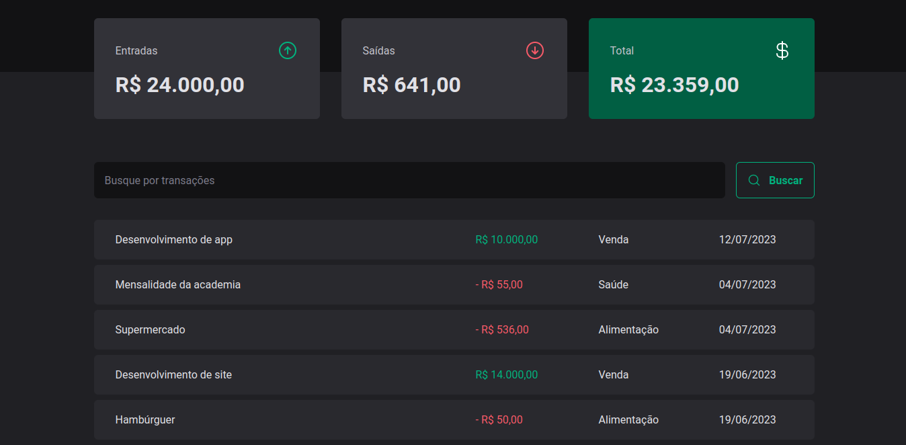
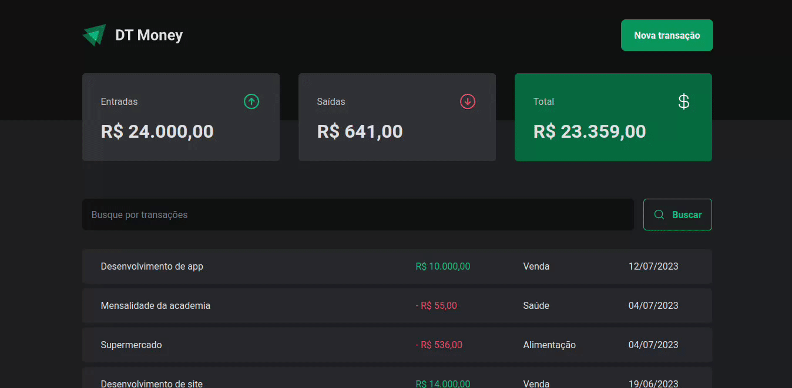
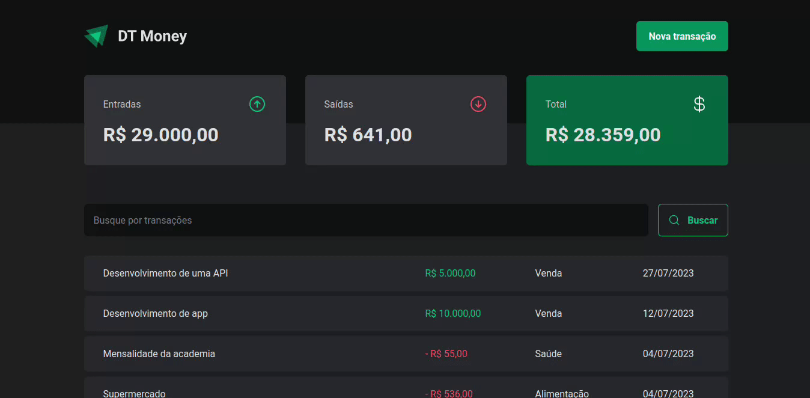

  

---

## Application developed to learn about connection with API and performance (This project was created with the Rocketseat's Teacher during the classes)

---

## 🎥 Preview

### 💰 You have all your transactions, the outcome, income values and the total

---

### 🆕 Adding a new transaction through a modal with accessibility

---

### 🔍 Search for the transactions

 

---

## 📚 Learning

All the things that I learned and practiced with this project

- I learn `connection with a API` to create and get the transactions
- I learn `performance` to improve my projects

 

---

## 🧪 Technologies

This project was developed using de following technologies:

- [React](https://react.dev/)
- [React Hook Form](https://react-hook-form.com/)
- [Axios](https://axios-http.com/ptbr/)
- [Styled Components](https://styled-components.com/)
- [Zod](https://zod.dev/)
- [React Router DOM](https://reactrouter.com/en/main)
- [Phosphor Icons](https://phosphoricons.com/)
- [Json Server](https://github.com/typicode/json-server)
- [Radix](https://www.radix-ui.com/)

 

---

## 🔖 Layout

You can view the project layout through the links below:

- [Layout](https://www.figma.com/community/file/1138814493269096792)

Remembering that you need to have a [Figma](http://figma.com/) account to access it.

 

---

Developed by [ricardorhv](https://github.com/ricardorhv) 👋
